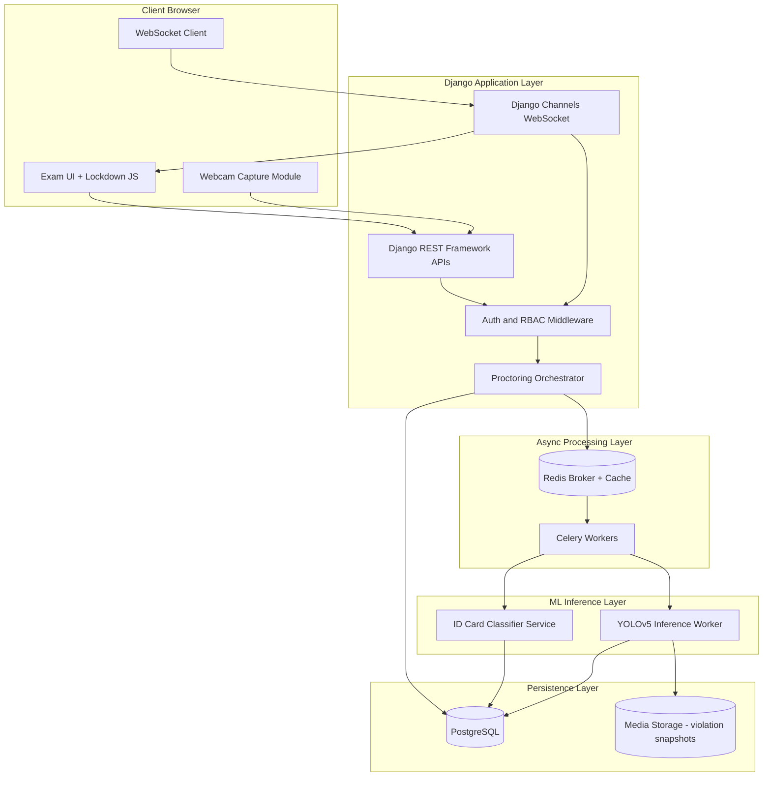
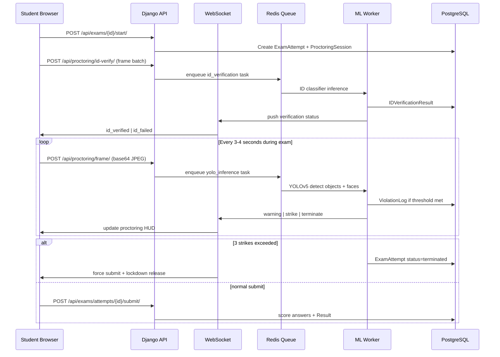
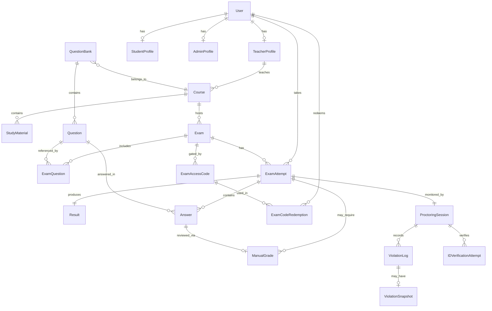
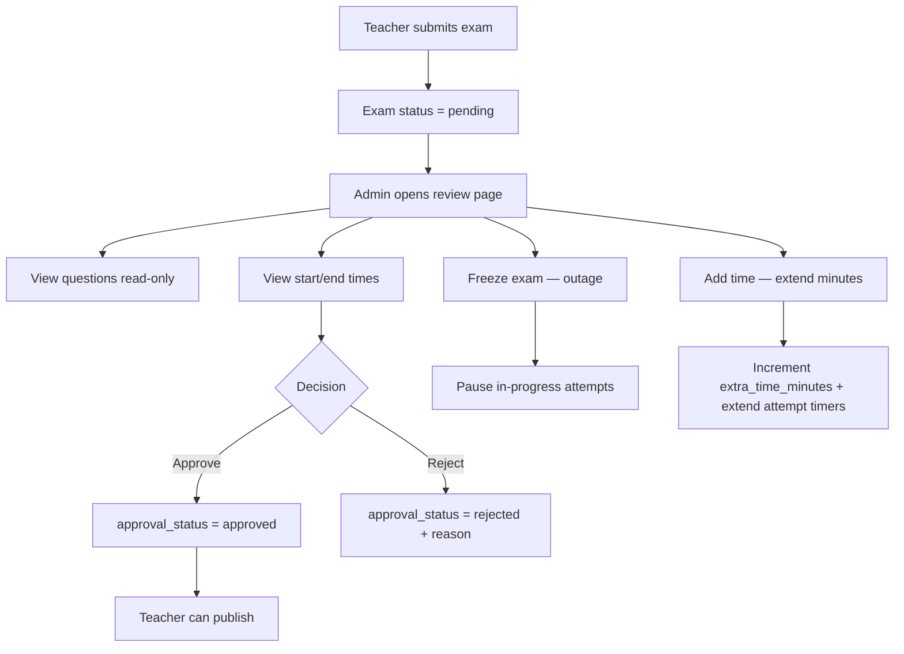

# Hybrid AI-Proctoring and Secure Online Examination System

> **Canonical reference** — read this document before any implementation work on this project.

---

## 0. Confirmed Design Decisions

| Area | Decision |
|------|----------|
| **Deployment** | Single local machine (dev/demo), **no GPU** — CPU-only YOLO inference |
| **Question types** | **MCQ + short text** — MCQ auto-graded; short answers flagged for **manual teacher review** |
| **Exam access** | **Exam code/link** — teacher generates a code; student must enter code to start |
| **ID verification** | **ID card in frame + face match** against the live face scan captured at registration (InsightFace ArcFace embedding in `StudentProfile.face_embedding`; no external university DB) |
| **Authentication** | **Django session auth** — server-rendered HTML pages, traditional login forms |
| **Lockdown** | **Teacher-configurable strictness** — `none` / `level_1` (3-strike) / `level_2` (zero tolerance); fullscreen + tab/focus violations at level 1+ |
| **Proctoring ML** | **YOLOv5n** object detection + **YOLOv8n-pose** skeleton capture on CPU via Celery; snapshots stored on `ViolationLog` |
| **Disconnect policy** | **Pause timer** — 2-minute grace period to reconnect; timer frozen while offline |
| **Question authoring** | **Question banks per course** — Question Builder UI, manual entry + CSV bulk import; teachers attach bank questions to exams |
| **Exam publication** | **Admin approval required** — teacher submits exam + questions + start/end window; admin approves before publish |
| **Exam incident control** | **Admin freeze + add time** — admin can freeze exams during outages (pauses attempts) or extend duration for active sessions |

---

## 1. System Architecture

### High-level layers



### Data flow: exam attempt lifecycle



### Project layout

```
exam_proctor/
├── config/                 # Django settings, urls, asgi (Channels)
├── apps/
│   ├── accounts/           # User, roles, teacher approval
│   ├── courses/            # Course, StudyMaterial
│   ├── exams/              # QuestionBank, Exam, Attempt, Result
│   └── proctoring/         # Session, Violation, ID verification
├── ml/
│   ├── id_classifier/      # Standalone ID model loader + inference
│   ├── yolo_service/       # YOLOv5 wrapper (ultralytics)
│   └── tasks.py            # Celery tasks calling ML services
├── static/js/
│   ├── lockdown.js         # Tab/focus/shortcut restrictions
│   └── proctor.js          # Webcam capture + WS client
├── templates/
└── docs/
    └── SYSTEM_DESIGN.md    # This file
```

### Key architectural decisions

| Decision | Choice | Rationale |
|----------|--------|-----------|
| Real-time updates | Django Channels + Redis | Push warnings/terminations instantly |
| Frame upload | REST POST every 3–4s | CPU-only local; avoids blocking WS |
| ML execution | Celery workers (separate processes) | Never run inference on Django threads |
| Model loading | One instance per worker at startup | Avoid reload per frame |
| ID verification | ID card detect + face match | No external university DB |
| Auth | Django session auth | Server-rendered pages; CSRF on forms |
| Exam access | Exam access code | Teacher generates code; student redeems |
| Grading | Hybrid auto + manual | MCQ instant; short answers pending review |
| Lockdown | Strict | Fullscreen mandatory; tab switch = strike |
| Offline | Timer pause | 2-min grace; server tracks remaining_seconds |
| Exam publish gate | Admin approval | Teacher submits; admin reviews questions + schedule; publish blocked until approved |
| Outage handling | Admin freeze | `is_frozen` blocks new starts; in-progress attempts paused |

---

## 2. Database Schema (ERD)

### Entity relationship diagram



### Core models

#### accounts

- **User** — `role`, `phone`, `profile_photo` (required for students)
- **StudentProfile** — `student_id_number`, `id_proof_image`, `face_embedding`
- **TeacherProfile** — `approval_status`, `approved_by`, `qualification`, `department`
- **AdminProfile** — OneToOne to User

#### courses

- **Course** — `code`, `title`, `teacher`, `is_active`
- **StudyMaterial** — `course`, `title`, `file`

#### exams

- **QuestionBank** — `course`, `title`, `status` (draft/pending/approved/rejected), `submitted_at`, `created_by`
- **Question** — `mcq`, `true_false`, `short_answer`; `section`, `order`, `marks`, `options`, `correct_answer`, `explanation`, `is_complete`, `difficulty`, `blooms_level`, `module_tags`
- **Exam** — timing, marks, publish window (`available_from`, `available_until`), `requires_access_code`, **`approval_status`** (draft/pending/approved/rejected), **`submitted_for_approval_at`**, **`approved_by`**, **`approved_at`**, **`rejection_reason`**, **`is_frozen`**, **`frozen_at`**, **`frozen_reason`**, **`extra_time_minutes`**
- **ExamAccessCode**, **ExamCodeRedemption**
- **ExamQuestion** (through table — `order`, optional `marks_override`)
- **ExamAttempt** — `status`, timer pause fields, `remaining_seconds`, `grading_status`
- **Answer** — `review_status` for manual grading queue
- **ManualGrade**, **Result**

**Effective exam duration** = `duration_minutes + extra_time_minutes` (used at attempt start and when admin adds time).

#### proctoring

- **ProctoringSession** — strikes, ID verification status, lockdown flag
- **IDVerificationAttempt** — ID + face match scores
- **ViolationLog**, **ViolationSnapshot** (`image`, `bounding_boxes`, `pose_keypoints`, frame dimensions)

---

## 2.1 Teacher question bank workflow

Teachers build exams from **reusable question banks** scoped to a course. Questions are authored in the **Question Builder**, then **selected into an exam** via the `ExamQuestion` through table (order + optional marks override). Publication requires **admin approval** of the exam package (questions + schedule).

### Teacher dashboard navigation

The faculty portal exposes a top tab bar on the teacher dashboard:

**Dashboard** · **Question Banks** · **Exams** · **Courses** · **Flagged Sessions** (teachers) · **Proctoring Audit** (admins, read-only)

The dashboard **Question Banks** panel lists recent banks with a direct link to **Open Builder**.

### Workflow diagram

```mermaid
flowchart LR
    A[Approved teacher] --> B[Create / select Course]
    B --> C[Create Question Bank]
    C --> D{Add questions}
    D --> E[Question Builder]
    D --> F[CSV bulk import]
    E --> G[Question Library]
    F --> G
    G --> H[Create Exam for course]
    H --> I[Attach questions from bank]
    I --> J[Set order and preview]
    J --> K[Set start and end times]
    K --> L[Submit for admin approval]
    L --> M{Admin review}
    M -->|Approve| N[Teacher publishes exam]
    M -->|Reject| O[Teacher revises and resubmits]
    N --> P[Generate access code]
    P --> Q[Students redeem and take exam]
```



### Step-by-step (teacher)

1. **Gate** — Teacher must be admin-approved (`TeacherProfile.approval_status = approved`).
2. **Course** — Teacher creates or owns a `Course`.
3. **Question bank** — One bank per topic/pool (e.g. “CS304 Midterm II”), tied to exactly one course.
4. **Add questions** (Question Bank Management)
   - **Builder** — three-panel editor (see below)
   - **Bulk Import** — CSV upload with row validation
   - **Question Library** — read-only list of all bank questions with links back to Builder
5. **Bank management** — edit, mark complete, delete questions (delete blocked if used in an exam).
6. **Build exam** — create `Exam` → attach questions from course banks → drag to reorder.
7. **Schedule** — set `available_from` and `available_until` on the exam (required before submission).
8. **Preview** — teacher-only preview shows stems, options, and correct answers (never exposed during student attempt).
9. **Submit for approval** — sets `Exam.approval_status = pending`; teacher cannot publish until approved.
10. **Publish** — after admin approval, teacher publishes and generates access codes.
11. **Grading** — MCQ/T-F auto-graded; short answers enter manual review queue.

### Question Builder UI (teacher)

Route: `/exams/question-banks/{id}/builder/`

Header: **KNUST Exam Proctoring System — Question Bank Management** with sub-tabs:

| Tab | Route | Purpose |
|-----|-------|---------|
| **Builder** | `…/builder/` | Three-panel question editor |
| **Bulk Import** | `…/import/` | CSV upload |
| **Question Library** | `…/library/` | Full question list |

**Layout:**

| Panel | Contents |
|-------|----------|
| **Left — Exam outline** | Questions grouped by `section`; completion checkmarks; total questions/points; progress bar |
| **Center — Editor** | Question stem, MCQ options preview, correct answer, explanation |
| **Right — Metadata** | Points, section, Bloom's level, difficulty (easy/medium/hard), module tags, mark-as-complete |

Toolbar actions: Preview, Import Questions, Save Bank. Per-question: Copy, Delete, Save, Next.

**Question fields stored on `Question`:**

- `section` — e.g. “Section A: Multiple Choice”, “Section B: Short Answer”
- `order` — display order within bank
- `is_complete` — teacher progress tracking
- `difficulty`, `blooms_level`, `module_tags` — metadata for analytics (future)

---

## 2.2 Admin exam approval and incident control

Admins **do not edit** teacher questions. They **view** submitted exam content and schedule, then **approve**, **reject**, **freeze**, or **extend time**.

### Admin workflow



### Exam approval states

| `approval_status` | Meaning | Teacher can publish? |
|-------------------|---------|----------------------|
| `draft` | Exam being built | No |
| `pending` | Submitted, awaiting admin | No |
| `approved` | Admin signed off questions + schedule | Yes |
| `rejected` | Admin rejected with reason | No (must revise and resubmit) |

**Publish gate:** `Exam.is_published` may only be set when `approval_status = approved` and at least one `ExamQuestion` exists.

**Why publication is separate from approval.** The availability window already
stops students entering early, so publication is not an access control. It exists
to keep responsibility unambiguous (the teacher who owns the content owns the
go-live), to give the teacher a last-mile abort without another admin round-trip,
and to re-validate the schedule at go-live since approval may be days old.

Its failure mode is a teacher who forgets: an approved, unpublished exam would
quietly never open. `Exam.publish_urgency()` classifies that state as `later`,
`soon` (window within `PUBLISH_SOON_HOURS`), `missed` (window already open) or
`expired` (window closed unpublished — the schedule must be reset and reapproved).
It is surfaced on the teacher dashboard, in the exam list, on the exam detail page
and as a sidebar badge (`awaiting_publish`).

**Availability gate:** `Exam.is_available()` returns false when:
- not published, or
- not approved, or
- `is_frozen = true`, or
- outside `available_from` / `available_until` window

### Admin review page (read-only questions)

Route: `/exams/admin/{id}/review/`

Admin sees:
- Exam title, course, teacher name
- **Start time** (`available_from`) and **end time** (`available_until`)
- Duration + any **extra time** already added
- Full list of attached questions (type, section, marks, correct answer / reference — view only)
- Approval / reject actions
- **Freeze** / **Unfreeze** controls
- **Add time** form (minutes)

Pending queue: `/exams/admin/pending/`

Admin dashboard sidebar: **Exam Approvals** (badge count of pending exams).

### Freeze (outage handling)

When admin **freezes** an exam:
- `Exam.is_frozen = true`, `frozen_at`, `frozen_reason` recorded
- New student starts blocked (`is_available()` false)
- Active `in_progress` attempts → `paused` with `timer_paused_at` set

When admin **unfreezes**:
- `is_frozen = false`
- Paused attempts (from freeze) → `in_progress`, timer resumes

### Add time (incident extension)

When admin adds `N` minutes:
- `Exam.extra_time_minutes += N`
- All `in_progress` and `paused` attempts: `remaining_seconds += N * 60`
- New attempts use `effective_duration_minutes = duration_minutes + extra_time_minutes`

Implementation: `apps/exams/services/exam_control.py` (`freeze_exam`, `unfreeze_exam`, `add_exam_time`).

### Admin vs teacher permissions (exams)

| Action | Teacher | Admin |
|--------|---------|-------|
| Create/edit questions in Builder | Own courses | No (view only via review) |
| Attach questions to exam | Own courses | No |
| Submit exam for approval | Yes | — |
| Approve/reject exam | No | Yes |
| Publish exam | After approval | No |
| Freeze / unfreeze exam | No | Yes |
| Add time to exam | No | Yes |
| View all exams / banks | Own only | All |
| View results roster / student responses | Author or course owner | **No** |
| Grade short answers | Author or course owner | **No** |
| Review flagged proctoring sessions | Author or course owner | Read-only audit |

### CSV import format

Required columns: `type`, `text`, `correct`, `marks`.  
Optional: `option_a` … `option_f`, `explanation`.

| type | text | option_a | option_b | option_c | option_d | correct | marks |
|------|------|----------|----------|----------|----------|---------|-------|
| mcq | What is 2+2? | 2 | 3 | 4 | 5 | C | 1 |
| true_false | The sky is blue. | | | | | true | 1 |
| short_answer | Define polymorphism. | | | | | OOP technique | 2 |

`type` values: `mcq`, `true_false`, `short_answer` (aliases accepted, e.g. `tf`).

### Permissions

- Teachers may only manage banks and exams for **their own courses**.
- Admins may manage all courses, banks, and exams.
- Questions can only be added to an exam if they belong to a bank for **the same course** as the exam.

#### Student work is teacher-only

Marks, answers and per-attempt proctoring evidence follow a **narrower** rule
than exam management, enforced by `user_can_view_attempts` in
`apps/exams/permissions.py`:

- The exam's **author** (`Exam.created_by`) may view it.
- The **course owner** may view it. Normally the same person, since `ExamForm`
  only offers a teacher their own courses; the two diverge for admin-authored
  exams and for reassigned courses, and either alone would strand someone.
- **Admins are refused**, including superusers. Administering the platform is
  not a reason to read a named student's answers. Admins keep exam approval,
  aggregate dashboard statistics, and the read-only proctoring audit — none of
  which expose answers or per-student marks.

This covers the results roster, the responses modal, the single result page,
pending reviews, manual grading, violation review, attempt invalidation, and
the proctoring WebSocket. Attempt-scoped views re-derive the exam from the
attempt before checking, so a guessed `attempt_id` cannot cross courses.

### UI routes (session auth)

#### Teacher — question banks

| Method | Endpoint | Purpose |
|--------|----------|---------|
| GET | `/exams/question-banks/` | List banks |
| GET/POST | `/exams/question-banks/create/` | Create bank |
| GET | `/exams/question-banks/{id}/builder/` | Question Builder (primary editor) |
| GET | `/exams/question-banks/{id}/library/` | Question Library |
| GET/POST | `/exams/question-banks/{id}/import/` | CSV bulk import |
| GET/POST | `/exams/question-banks/{id}/questions/add/` | Add question (redirects to Builder) |
| GET/POST | `/exams/question-banks/{id}/questions/{qid}/edit/` | Full-form edit |
| POST | `/exams/question-banks/{id}/questions/{qid}/delete/` | Delete question |

#### Teacher — exams

| Method | Endpoint | Purpose |
|--------|----------|---------|
| GET/POST | `/exams/{id}/questions/` | Attach bank questions, reorder, remove |
| GET | `/exams/{id}/preview/` | Preview with answers |
| POST | `/exams/{id}/submit-approval/` | Submit for admin approval |
| POST | `/exams/{id}/publish/` | Publish (requires approval) |
| POST | `/exams/{id}/delete/` | Delete exam (blocked if any student attempts exist) |

#### Admin — exam oversight

| Method | Endpoint | Purpose |
|--------|----------|---------|
| GET | `/exams/admin/pending/` | Pending approval queue |
| GET/POST | `/exams/admin/{id}/review/` | View questions + schedule; approve/reject/freeze/add time |

---

## 3. API Endpoints

Base: `/api/v1/` for JSON (proctor JS). Most pages are server-rendered with session auth.

### Auth (session)

| Method | Endpoint | Role |
|--------|----------|------|
| GET/POST | `/register/` | Public |
| GET/POST | `/login/` | Public |
| POST | `/logout/` | All |
| GET | `/dashboard/` | All (role redirect) |

### Exams and grading

| Method | Endpoint | Role | Notes |
|--------|----------|------|-------|
| GET/POST | `/exams/question-banks/…` | Teacher | Question bank + Builder (§2.1) |
| GET/POST | `/exams/{id}/questions/` | Teacher | Attach bank questions to exam |
| GET | `/exams/{id}/preview/` | Teacher | Teacher preview |
| POST | `/exams/{id}/submit-approval/` | Teacher | Submit for admin approval |
| POST | `/exams/{id}/publish/` | Teacher | Requires `approval_status = approved` |
| POST | `/exams/{id}/delete/` | Teacher / Admin | Course owner or admin; blocked when attempts exist |
| GET | `/exams/admin/pending/` | Admin | Pending exam queue |
| GET/POST | `/exams/admin/{id}/review/` | Admin | Approve/reject/freeze/add time |
| POST | `/exams/redeem-code/` | Student | Redeem access code |
| POST | `/exams/{id}/start/` | Student | Blocked if frozen or not approved |
| PATCH | `/exams/attempts/{id}/answers/` | Student | Autosave answers |
| POST | `/exams/attempts/{id}/submit/` | Student | Submit attempt |
| POST | `/exams/attempts/{id}/reconnect/` | Student | Resume after disconnect |
| GET | `/exams/{id}/pending-reviews/` | Teacher | Short-answer grading queue |
| POST | `/answers/{id}/grade/` | Teacher | Manual grade |

### Proctoring

| Method | Endpoint | Purpose |
|--------|----------|---------|
| POST | `/api/v1/proctoring/id-verify/` | Enqueue ID + face check |
| POST | `/api/v1/proctoring/frame/` | Enqueue YOLO inference |
| POST | `/api/v1/proctoring/client-event/` | Lockdown violations (sync strikes) |
| WS | `/ws/proctoring/{attempt_id}/` | Warnings, terminate, heartbeat |

---

## 4. Background Processing

### Pattern: accept → queue → infer → push

Django view validates and enqueues Celery task, returns immediately. Worker runs **YOLOv5n** (objects) and **YOLOv8n-pose** (skeleton keypoints), writes violations + snapshots, pushes via Channels.

**ID verification worker** (queue: `id_verification`, concurrency=1):
1. ID card CNN (confidence >= 0.85)
2. Face match vs registration face-scan embedding (InsightFace `buffalo_l` ArcFace, cosine similarity >= 0.35, `ml/face_id`)

Each round returns one of four outcomes (`ml/id_verification/exam_verify.py`), and
only the first two are identity decisions:

| Outcome | Meaning | Effect |
|---------|---------|--------|
| `match` | Face matches the reference | Admitted, attempt goes `IN_PROGRESS` |
| `no_match` | Face compared and rejected | Counts toward `MAX_ID_VERIFICATION_ATTEMPTS`; exhausting them terminates the attempt |
| `no_face` | No face readable in the webcam frame | Retried (client auto-retries, then offers a button); never admits, never terminates |
| `unavailable` | No comparison possible — reference face or model missing | Retried; after `MAX_ID_VERIFICATION_FAULTS` the student is admitted with `id_verification_status = unverified` and the session is flagged for review |

The reference face is read from `StudentProfile.face_embedding`, falling back to
the registration photo on the `User` (so a deleted profile row degrades to "cannot
verify", not to a false identity failure). `manage.py repair_student_profiles`
rebuilds missing profiles and embeddings. Set `PROCTORING_ADMIT_WHEN_UNVERIFIABLE=false`
to keep unverifiable students retrying instead of admitting them.

**Local CPU tuning**: YOLOv5n, 3–4s frame interval, Celery concurrency=1, ~5–10 concurrent exams.

### Three-strike rule

Atomic increment on `ProctoringSession` with `select_for_update()`. Lockdown events processed synchronously in Django view.

### Disconnect / timer pause

- Heartbeat every 10s over WebSocket
- 2 missed heartbeats → `status=paused`, store `remaining_seconds`
- Reconnect within 120s via `POST .../reconnect/`
- Grace expired → auto-submit saved answers

### Admin freeze (distinct from disconnect pause)

- Admin **freeze** sets `Exam.is_frozen` and pauses all `in_progress` attempts (system-wide outage)
- Admin **unfreeze** resumes paused attempts
- Admin **add time** extends `extra_time_minutes` and bumps `remaining_seconds` on active attempts
- Student disconnect pause (§ above) is per-attempt and unrelated to admin freeze

---

## 5. Frontend JS Modules

- **lockdown.js** — strict fullscreen, block shortcuts/copy-paste, sync client events
- **proctor.js** — webcam capture every 3–4s, frame POST, WS HUD, heartbeat

---

## 6. Security

- HTTPS recommended locally (mkcert) for webcam
- CSRF on all POST/AJAX
- Rate limit frames: 1 req/3s per attempt
- Never expose `correct_answer` during attempt
- Teacher approval gate for unapproved teachers (`TeacherProfile.approval_status`)
- **Exam approval gate** — students cannot start exams until admin approves (`Exam.approval_status = approved`)
- Admins have **read-only** access to teacher questions on the review page (no edit endpoints)
- Only admins may freeze exams or add time (`@role_required(ADMIN)` on review actions)

---

## 7. Implementation Phases

| Phase | Scope |
|-------|-------|
| 0 | This document + Cursor rule |
| 1 | Django scaffold, models, session auth, exam codes, MCQ auto-grade, manual review queue, **question bank workflow**, **Question Builder UI**, **admin exam approval**, **freeze/add time** |
| 1b | Student/teacher ID OCR registration, admin/teacher dashboards (Figma UI) |
| 2 | Celery, Redis, Channels, lockdown JS, timer pause, three-strike (mock ML) |
| 3 | **YOLOv5n + YOLOv8n-pose**, violation snapshots (bbox + pose JSON), exam-time ID/face verify, admin read-only proctoring audit |
| 4 | Manual grading UI polish, My Marks, question analytics, expanded test suite |

---

## 8. Dependencies

See [`requirements.txt`](../requirements.txt).
